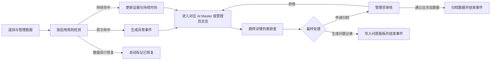
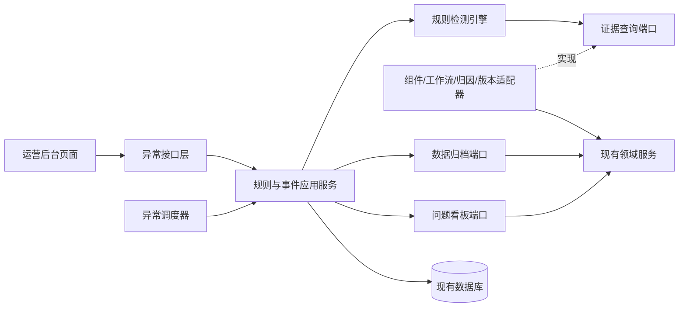

# 遥测平台异常事件机制功能设计

## 1. 设计结论

运营后台应从“展示全部统计数据”转为“发现并处理异常事件”。系统管理员通过规则管理页面维护异常规则；平台持续检测遥测数据并生成异常事件；AI Master 打开总览后，只看到其负责范围内已经发生的问题，并能获得足够的数据和详情入口完成判断。

整套机制服务于两个角色：

- **AI Master**：查看负责范围内的异常，分析具体人员和使用过程，选择最终处理方式。
- **系统管理员**：管理异常规则、查看全组织异常、审核归档申请。

异常事件不建设复杂工单流。AI Master 的最终处理动作只有两个：

1. 申请屏蔽：是否允许由命中的检测规则配置，系统管理员可以随时调整。填写理由提交系统管理员审核；关联可恢复业务数据时归档业务数据，否则只屏蔽本次异常事件，不修改原始遥测记录。
2. 提问题 / 提诉求：以弱化的小图标提供快捷入口，同步生成问题看板记录；这是补充反馈能力，不作为日常核心处理动作。

跳转工作流、归因、版本和组件详情属于排查入口，不改变异常事件状态。归因重跑等原业务能力继续留在归因详情页，异常中心不复制这类修复操作。

---

## 2. 目标与边界

### 2.1 目标

- 系统为全部内置检测类型预置规则，系统管理员可以查看、编辑、停用和启用规则，并控制每类规则是否允许申请屏蔽。
- AI Master 可以快速看到负责仓库及人员范围内有哪些异常。
- 每条异常都直接说明命中原因，页面不出现规则编码等机器语言，并提供充分的上下文数据。
- 不同类型的异常能够跳转到对应详情列表，并自动带入筛选条件。
- 异常数据归档必须明确范围、填写理由并经过管理员审核。
- 异常可以一键同步为问题看板记录，避免人工重复整理证据。

### 2.2 非目标

- 不在异常总览中展示活跃人数、工作流总量、采纳率、版本分布等正常统计。
- 不建设优先级、认领、协同、转派、催办等完整工单能力。
- 不在异常事件中重复实现工作流、归因、版本等详情页面已有功能。
- 不允许管理员编写任意 SQL、脚本或 JSON 参数；新增检测类型属于系统能力扩展，不在管理页面完成。

---

## 3. 角色与权限

| 角色 | 可见范围 | 可以执行的操作 |
|---|---|---|
| AI Master | 当前所选 AI Master 负责的仓库，以及这些仓库中的人员、工作流、归因和版本异常 | 查看异常详情、跳转具体业务对象、申请屏蔽、快捷提交问题或诉求 |
| 系统管理员 | 全组织异常、全部规则和全部屏蔽申请 | 管理规则、查看所有异常、审核屏蔽申请、恢复已屏蔽数据 |

AI Master 的责任范围沿用现有仓库归属关系。能够定位到仓库的异常自动进入对应 AI Master 的总览；无法定位到仓库的组件级或系统级异常只对系统管理员展示。

总览的查看范围由页面上选择的 AI Master 决定。首版没有账号体系，不提供跨 AI Master 的数据隔离承诺；“只能看到自己范围内的异常”这一隔离要求在引入账号体系后才成立，首版口径是按所选范围过滤正确。

开放异常随仓库归属变更转移到新的 AI Master；历史处理记录保留当时的责任人信息。

### 3.1 简化权限方案

首版不建设账号、角色和权限系统，只提供一个系统管理员密码：

> 系统管理员密码：`123456`

使用规则如下：

- 查看 AI Master 异常总览不需要管理员密码，范围由当前选择或已有 AI Master 身份确定。
- 进入规则管理、保存规则变更、停用或启用规则、审核屏蔽申请、恢复已屏蔽数据时需要验证管理员密码。
- 密码验证成功后形成管理员会话，以 HttpOnly Cookie 承载，8 小时失效；退出管理模式后立即失效。
- 管理员操作记录统一标记为“系统管理员”，并保存时间、操作对象和变更内容。
- `123456` 是首版暂定值，应由服务端配置，不写入前端页面源代码。

---

## 4. 核心对象

### 4.1 异常规则

异常规则描述“检查什么数据、在什么范围内检查、满足什么条件时生成异常，以及是否允许 AI Master 申请屏蔽”。每种内置检测类型对应一条系统预置规则；管理员修改、停用或启用规则，不在页面自由创建检测逻辑。

一条规则至少包含：

- 规则名称与所属分类；
- 检测类型；
- 生效范围：全平台、指定组件或指定仓库；
- 具体检测参数；
- 是否允许 AI Master 申请屏蔽；
- 检测频率；
- 异常恢复条件；
- 当前状态：启用或停用；
- 创建人、修改人、创建时间和修改时间；
- 稳定的规则 ID、规则版本与变更原因：规则修改生成新版本，但不改变逻辑规则 ID；历史事件引用命中时的参数快照。

服务启动时幂等补齐缺失的内置规则。新增检测类型需要在服务端登记检测器、默认参数和管理界面字段含义，并通过版本发布加入；页面只展示业务字段，不展示检测器编码和参数 JSON。

### 4.2 异常事件

异常事件表示某个具体对象已经命中一条规则，例如“仓库 A 的工作流 123 已经 31 小时没有活动”。

事件至少包含：

- 开放事件键：稳定规则 ID、业务对象类型和业务对象 ID 的组合；同一组合在一次连续异常周期内只保留一个开放事件；
- 异常周期号：对象恢复后再次命中同一规则时生成新周期，历史周期保持不变；
- 命中的规则及规则参数快照；
- 组件、仓库、人员和具体业务对象；
- 首次发现、最近命中和持续时间；
- 实际值、触发值、统计窗口和原始证据；
- 当前 AI Master；
- 详情跳转所需的对象引用与预置筛选条件，跳转地址在渲染时生成、不入库，避免页面路由调整后历史事件死链；
- 归档申请或问题看板记录；
- 自动恢复、已归档或已转问题等最终结果。

同一规则、同一业务对象持续命中时，只更新本周期事件的最近命中时间、证据和命中次数，不重复生成事件。对象恢复后关闭本周期；之后再次命中时生成新的异常周期。规则版本只更新事件的命中快照，不参与开放事件去重。

### 4.3 归档申请

归档申请表示某条数据不应该继续参与统计和展示，请系统管理员确认。申请有两条发起入口，共用同一张审核清单：

- 异常事件入口：AI Master 在异常总览对事件申请屏蔽，申请关联异常事件；
- 业务页入口：运营管理员在工作流页或归因页对工作流、开发产出或归因结果直接申请屏蔽，申请不关联异常事件。

归档申请包含：

- 发起入口（异常事件 / 业务页）与关联异常事件（业务页发起时为空）；
- 申请归档的数据范围；
- 必填理由；
- 归档后的统计影响预览；
- 申请人和申请时间；
- 审核状态、审核人、审核时间和审核意见。

同一数据对象存在待审核申请时不允许重复提交。

### 4.4 问题看板记录

问题看板记录用于沉淀需要优化的平台、组件或使用体验问题。记录由异常事件自动预填证据，AI Master 只需补充优化建议。

### 4.5 屏蔽范围

规则的“允许申请屏蔽”属性决定对应异常是否展示申请入口。管理员审核通过后优先屏蔽异常关联的可恢复业务数据；没有独立归档载体时只结束并屏蔽本次异常事件，原始遥测和人员版本轨迹保持不变：

| 异常分类 | 可归档数据 | 审核通过后的结果 |
|---|---|---|
| 组件统计异常 | 开发产出、归因记录或异常事件 | 能定位业务数据时归档数据，否则屏蔽本次事件 |
| 工作流异常 | 工作流运行、开发产出 | 归档数据 |
| 归因异常 | 归因记录、开发产出 | 归档数据 |
| 版本异常 | 异常事件 | 屏蔽本次事件，不修改版本上报历史 |

---

## 5. 首批异常检测类型

系统为以下检测类型预置规则。表中的数值是建议默认值，管理员可在业务表单中调整。

表中编码仅用于本文档和系统内部标识，所有页面一律不展示编码。每个检测类型提供一句面向用户的简述（以表内“异常条件”为基础提炼），规则列表、异常列表和事件详情统一展示规则名称、简述和关键参数，例如“工作流已 31 小时没有任何活动，超过 24 小时阈值”，而不是规则编码。

### 5.1 组件统计异常

| 编码与检测类型 | 异常条件 | 可配置参数 | 建议默认值 | 主要查看人 |
|---|---|---|---|---|
| CP-01 数据上报中断 | 近期存在开发活动，但连续一段时间没有有效遥测上报 | 无上报时长、活跃识别窗口 | 3 个工作日、14 天 | 能定位仓库时为 AI Master，否则为管理员 |
| CP-02 核心统计突变 | 上报数、活跃人数或有效产出量明显偏离自身历史基线 | 指标、基线窗口、偏离比例、最小样本、连续命中次数 | 28 天、50%、10、2 次 | 系统管理员 |
| CP-03 数据无法归属 | 上报到达，但仓库、组件或人员不能匹配登记关系 | 统计窗口、未归属数量、未归属比例 | 24 小时、3 条、5% | 系统管理员；可定位人员时同步给 AI Master |

### 5.2 工作流使用异常

| 编码与检测类型 | 异常条件 | 可配置参数 | 建议默认值 | 主要查看人 |
|---|---|---|---|---|
| WF-01 工作流停滞 | 工作流进行中，但长时间没有步骤、状态或人工确认更新 | 无活动时长 | 24 小时 | AI Master |
| WF-02 步骤执行失败 | 关键步骤进入失败或阻塞状态，并且未及时恢复 | 关注状态、恢复宽限期、连续失败次数 | failed/blocked、30 分钟、1 次 | AI Master |
| WF-03 状态前后不一致 | 工作流、步骤和产物状态相互矛盾 | 不一致持续时长、检查的状态组合 | 10 分钟、平台默认组合 | AI Master；系统数据问题同时对管理员展示 |
| WF-04 人工门禁超时 | 到达人工确认节点后长时间没有通过或退回 | 等待时长、适用门禁类型 | 24 小时、全部人工门禁 | AI Master |

### 5.3 归因处理异常

| 编码与检测类型 | 异常条件 | 可配置参数 | 建议默认值 | 主要查看人 |
|---|---|---|---|---|
| AT-01 补丁缺失 | 开发产出结束后未收到可归因的最终补丁 | 补丁等待时长、适用产出类型 | 24 小时、全部开发产出 | AI Master |
| AT-02 计算任务卡住 | 归因任务在待处理、执行中或退避状态停留过久 | 各状态允许时长 | 待处理 2 小时、执行中 30 分钟、重试逾期 1 小时 | 系统管理员；关联仓库的 AI Master 可见 |
| AT-03 计算执行失败 | 归因因 MR、Diff、权限或算法问题失败 | 最小重试次数、纳入的失败原因 | 3 次、全部失败原因 | AI Master 或系统管理员，按失败原因展示 |
| AT-04 结果质量异常 | 归因结果违反数据约束、目标不一致或带有质量标记 | 质量标记范围、同类异常数量 | 全部质量标记、1 条 | 系统管理员；关联仓库的 AI Master 可见 |

### 5.4 版本使用异常

| 编码与检测类型 | 异常条件 | 可配置参数 | 建议默认值 | 主要查看人 |
|---|---|---|---|---|
| VR-01 旧版本持续活跃 | 使用者持续上报落后于当前正式版本的版本 | 落后版本位、活跃窗口、连续上报次数 | 1 位、7 天、2 次 | AI Master |
| VR-02 使用非发布版本 | 正式用户或仓库持续上报 smoke、dev 或未登记版本 | 统计窗口、连续上报次数、测试白名单 | 24 小时、2 次、空 | AI Master；发布登记问题对管理员展示 |
| VR-03 版本发生回退 | 使用者已经使用较新版本，随后持续使用旧版本 | 回退确认次数、确认窗口、忽略标签 | 2 次、24 小时、测试标签 | AI Master |

---

## 6. 异常规则管理

规则管理位于原有运营后台的“异常”页签内，通过页内视图切换进入，页面名称统一为“异常规则管理”；不再建设第二套运营后台或独立导航框架。

### 6.1 规则列表

规则列表展示：

- 规则名称、分类和检测类型；
- 生效范围；
- 核心参数摘要；
- 状态；
- 最近修改时间；
- 最近一次检测结果：命中对象数；
- 是否允许申请屏蔽；
- 查看、编辑、停用/启用操作。

支持按分类、检测类型、状态、组件和仓库筛选。

### 6.2 预置规则

- 系统为每个内置检测类型创建一条规则，部署升级时幂等补齐缺失项。
- 新补齐的规则沿用检测类型定义的默认启停状态；新检测类型默认停用，由管理员确认后再启用，避免升级后未经确认直接改变异常口径。
- 管理页面不提供新增和删除入口；需要新增检测类型时走代码评审、迁移和发布流程。
- 管理员只需理解检测类型的业务说明、判定条件、生效范围、屏蔽权限和启停状态。

### 6.3 规则详情

规则详情分为四个区块：

1. **基本信息**：业务名称、说明、生效范围、状态和是否允许申请屏蔽。
2. **检测条件**：使用业务名称、数值和单位展示参数，不显示检测器编码或 JSON。
3. **当前命中情况**：开放异常数、涉及组件/仓库数、最近检测时间和样例事件。
4. **变更记录**：新增、编辑、启用、停用、删除的操作人、时间、前后值和原因。

### 6.4 编辑规则

- 管理员可以修改范围、业务参数、启停状态和“允许申请屏蔽”属性；检测类型不可修改。
- 保存前必须试算并展示“将新增、继续保持、自动恢复”的事件数量。
- 修改只影响下一次检测，不回写已结束事件的规则快照；开放事件在下一次检测中按新版本重算，继续命中则更新当前命中版本与证据，不再命中则自动恢复。
- 修改启用规则时需要填写变更原因并验证管理员密码。

### 6.5 停用与启用规则

- 停用是可恢复操作，规则配置和历史事件继续保留，但不再产生新事件。
- 停用时必须填写原因；已有开放事件统一结束检测，结束原因为“规则已停用”，不伪装成数据自行恢复。
- 重新启用后从下一次检测开始生效，不补算停用期间的历史事件。
- 停用和启用都需要验证管理员密码。

---

## 7. 异常生成与恢复

### 7.1 检测方式

- 数据到达时检测状态失败、状态不一致、非发布版本和版本回退等即时异常。
- 定时检测上报中断、工作流停滞、门禁超时、补丁缺失和计算任务卡住等时间型异常。
- 数量或比例类规则通过最小样本和连续命中次数防止数据抖动。
- 同一规则、同一业务对象只保留一个开放事件。

### 7.2 事件状态

异常事件使用两个相互独立的状态维度，避免把“问题是否仍存在”和“采取过什么动作”混成一个状态。

| 检测状态 | 含义 |
|---|---|
| 异常中 | 当前检测仍命中规则 |
| 已恢复 | 当前检测不再命中规则，本异常周期结束 |

| 处理状态 | 含义 |
|---|---|
| 待处理 | 尚未选择最终处理方式 |
| 归档审核中 | 已提交归档申请，等待管理员审核 |
| 已归档 | 归档申请通过，相关数据不再纳入统计和普通展示 |
| 已转问题 | 已成功生成问题看板记录 |

规则停用或删除通过独立的结束原因记录，不作为“数据已恢复”。已结束周期再次命中时创建新周期，不复用或覆盖历史事件。

状态流转补充三条边界：

- 审核期间数据自行恢复：事件直接转为已恢复，未决的归档申请自动作废并通知申请人。
- 审核期间数据再次命中其他规则：不影响在审申请；新规则照常生成新事件。

归档申请被拒绝后，事件回到待处理，并展示管理员的拒绝理由。

---

## 8. AI Master 异常总览

### 8.1 页面目标

AI Master 进入总览后能够立即回答：

1. 自己负责范围内发生了哪些异常？
2. 异常影响哪个人、仓库、工作流或开发产出？
3. 为什么被判定为异常，有哪些数据证据？
4. 应该去哪个详情列表继续判断？
5. 最终是申请归档，还是转成优化建议？

### 8.2 异常摘要

摘要只统计异常事件：

- 待处理；
- 归档审核中；
- 已转问题；
- 最近自动恢复。

摘要同时给出组件统计、工作流、归因和版本四类开放异常数量，页面不补充正常统计卡片。

### 8.3 异常列表

每条异常展示：

- 事件名称及规则简述：不出现规则编码，用一句话说明命中内容；
- 影响人员、仓库和业务对象；
- 异常持续时间；
- 实际值与触发条件；
- 最近一次命中的核心证据；
- 当前状态；
- “查看详情”“申请屏蔽”和弱化的“提问题 / 提诉求”图标入口。

“查看详情”以人可理解的字段说明异常事实，并跳转到已筛选、已定位的具体业务对象；不得直接展示内部证据 JSON。“申请屏蔽”只在事件能定位到工作流、开发产出或归因记录时显示，并作为常用操作突出；“提问题 / 提诉求”仅使用弱化图标承载。其他异常可以提交问题或诉求，也可以在数据恢复后自动结束。

### 8.4 异常详情

详情页按“问题、证据、原始数据、最终处理”组织：

1. **问题是什么**：规则简述、影响对象、首次发现、持续时间。
2. **为什么异常**：规则参数、实际值、触发值、统计窗口、计算口径。
3. **数据证据**：趋势、状态时间线、失败原因、相关原始记录和最近变化。
4. **详情跳转**：进入对应业务详情列表，并自动带入当前事件的筛选条件。
5. **最终处理**：常用动作是申请屏蔽异常数据；必要时通过小图标提交问题或诉求。
6. **处理结果**：归档审核记录、问题记录链接或自动恢复时间。

### 8.5 无异常状态

没有异常时只显示“当前负责范围内没有开放异常”，不通过展示正常统计填充页面。

---

## 9. 按异常类型跳转详情

异常事件负责指出问题和准备筛选条件，现有详情列表负责提供深入数据。

| 异常分类 | 跳转目标 | 自动带入的条件 | 需要提供的数据支持 |
|---|---|---|---|
| 组件统计异常 | 组件或仓库数据明细列表 | 组件、仓库、异常时间窗、未归属状态 | 上报趋势、原始上报记录、归属失败原因、组件与仓库登记关系 |
| 工作流异常 | 工作流列表或单个工作流详情 | 仓库、人员、工作流 ID、状态、异常时间窗 | 步骤时间线、失败/阻塞步骤、最后活动、人工门禁状态、相关产出 |
| 归因异常 | 归因记录列表或归因详情 | 仓库、人员、开发产出 ID、归因状态、失败原因 | 补丁状态、队列时间线、重试记录、失败原因、算法版本和归因结果 |
| 版本异常 | 旧版本人员列表或人员版本轨迹 | 人员、仓库、版本、异常时间窗 | 当前版本、最新正式版本、版本差距、首次/最近上报、版本切换时间线 |

跳转后页面顶部保留“来自异常事件”的返回入口，避免 AI Master 在多层列表中丢失上下文。

---

## 10. 最终处理动作

异常事件不提供认领、协同、转派、催办、手工关闭等工单动作。AI Master 完成数据判断后，常用处理是“申请屏蔽”；“提问题 / 提诉求”作为补充快捷入口。工作流、归因等领域已有的修复操作通过详情跳转使用，不进入异常事件状态机。

### 10.1 申请屏蔽

适用于测试数据、错误上报、无效产出或其他不应纳入统计与展示，且能够定位到具体可恢复数据对象的情况。

AI Master 发起申请时需要：

1. 确认归档数据范围：必须是当前异常关联的工作流、开发产出或归因记录；没有可归档对象时不能提交申请。
2. 填写归档理由，不能为空。
3. 查看影响预览，包括数据条数、影响的统计窗口和可能变化的统计项。
4. 提交给系统管理员审核。

管理员审核时可以：

- 查看异常证据和原始数据；
- 查看申请理由和统计影响预览；
- 通过申请；
- 拒绝申请并填写理由。

审核通过后：

- 涉及可归档数据的申请：数据采用逻辑归档，不物理删除；数据退出所有业务统计和普通详情展示；管理员仍可在归档数据视图中查询和恢复；异常事件标记为已归档。
- 归档申请人、审核人、理由、时间和影响结果完整留痕。

审核拒绝后，异常返回待处理，AI Master 可以根据审核意见重新判断或改为生成问题记录。

### 10.2 快捷提交问题或诉求

适用于数据本身真实存在，但反映出产品、流程、组件或平台需要改进的问题。

系统自动预填：

- 问题标题；
- 异常类型和规则；
- 影响人员、仓库和业务对象；
- 异常时间范围；
- 实际值、触发值和关键证据；
- 原始详情链接；
- 来源异常事件链接。

AI Master 只需补充：

- 问题现象说明；
- 建议优化方向。

创建成功后：

- 异常事件标记为已转问题；
- 事件详情展示问题看板记录编号和链接；
- 问题看板后续状态不反向控制异常事件状态；
- 同一异常事件不能重复创建多条问题记录。

---

## 11. 系统管理员页面

原有系统运营后台增加一个“异常”一级页签，页签内部包含三个视图：

### 11.1 全组织异常

- 查看全部开放异常；
- 按异常分类、规则、组件、仓库和 AI Master 筛选；
- 查看无法分配给 AI Master 的系统级异常；
- 跳转具体详情列表查看数据。

### 11.2 异常规则管理

- 查看规则列表与详情；
- 新增、编辑、停用、启用和删除规则；
- 试算规则影响；
- 查看规则命中情况和变更记录。

### 11.3 屏蔽审核

- 查看待审核、已通过和已拒绝的归档申请；
- 查看数据范围、申请理由、异常证据和影响预览；
- 通过或拒绝归档申请；
- 查询和恢复历史归档数据；

以上管理员操作均需先通过系统管理员密码验证进入管理模式。

---

## 12. 功能数据模型

以下为产品层需要保存的信息，不限定具体数据库表结构。各对象的基础字段见第 4 章，此处只列技术实现需要补充的增量。

### 12.1 异常规则

- 技术主键、生效范围的对象引用；
- 参数的结构化存储：按检测类型使用类型化参数模型，不做自由文本配置。

### 12.2 异常事件

- 技术主键、异常周期号，以及“稳定规则 ID + 业务对象类型 + 业务对象 ID”的开放事件唯一键；事件结束后释放开放键，允许下次命中生成新周期；
- 组件、仓库、人员、工作流、开发产出或版本等对象的引用而非副本；
- 证据快照的存储结构：足够还原判定依据，不追求完整复制原始记录。

### 12.3 归档申请

- 关联事件和数据范围；
- 申请理由与影响预览；
- 归档批次和恢复记录；

### 12.4 问题记录关联

- 关联异常事件；
- 问题看板记录编号和地址；
- 同步的证据摘要。

---

## 13. 软件架构设计

### 13.1 架构选择

本功能采用 **模块化单体 + 端口适配器** 架构，继续部署在现有 `telemetry-server` 中，不拆分新的微服务。

选择依据：

- 现有服务已经采用 FastAPI Router、Service、SQLAlchemy Model 和后台 Scheduler 的分层结构，本功能与现有数据、事务和页面跳转高度相关。
- 规则检测、事件生成、归档审核和问题记录规模有限，没有独立扩缩容或独立发布的必要。
- 保持单体可以让“归档审核通过 → 数据归档 → 事件结束”和“创建问题记录 → 建立事件关联”在同一数据库事务内完成。
- 通过端口隔离跨模块调用，仍然保留未来把规则计算或问题看板拆成独立服务的可能。

该选择避免了两种不合适的方案：一是不把所有逻辑继续堆入现有 `admin.py` 和管理页面；二是不为当前规模提前引入消息队列、分布式事务和多个微服务。

### 13.2 模块划分

| 模块 | 职责 | 明确不负责 |
|---|---|---|
| 异常接口层 | 参数校验、管理员鉴权、调用应用服务、返回页面所需数据 | 不编写规则判断，不直接修改其他业务表 |
| 规则管理 | 规则增删改查、启停、试算、版本与审计 | 不读取具体业务表计算异常 |
| 规则检测引擎 | 根据检测类型执行规则、生成标准化命中结果 | 不决定页面权限，不执行归档或创建问题 |
| 异常事件服务 | 去重、创建/更新事件、责任范围路由、自动恢复 | 不复制工作流、归因、版本的业务数据 |
| 证据适配层 | 从现有组件、工作流、归因、版本服务取得检测数据和详情链接 | 不持有异常规则和事件状态 |
| 归档审核 | 创建归档申请、影响预览、审核及恢复，维护归档关联 | 不自行实现各种数据类型的删除逻辑 |
| 问题看板适配器 | 将异常证据转换为现有问题创建请求并保存关联 | 不复制一套问题看板 |
| 管理员认证 | 集中校验管理员密码并维护管理会话 | 不参与 AI Master 范围计算 |
| 异常调度器 | 按周期触发启用规则检测，记录运行结果 | 不保存业务规则，不长期持有业务状态 |

异常模块内部可以按现有目录风格落在 `routers`、`services`、`models` 和迁移中，但跨领域访问必须经过服务端口，不能因为处于同一个代码仓就绕过边界。

### 13.3 依赖方向

接口层和调度器只依赖应用服务；应用服务与检测引擎只依赖由异常模块定义的端口，适配器实现端口并调用现有领域服务。现有工作流、归因、版本和问题模块不反向依赖异常模块，因此不会形成循环依赖。异常事件只保存对象引用、规则快照和证据快照，原始业务事实仍由原模块持有。

### 13.4 关键接口边界

| 端口 | 输入 | 输出 | 约束 |
|---|---|---|---|
| `EvidenceProvider` | 检测类型、作用范围、时间窗 | 标准化候选对象、实际值和证据 | 各检测器不直接查询其他领域内部表 |
| `DetailLinkProvider` | 事件类型与对象引用 | 页面地址和预置筛选条件 | 链接在渲染时集中生成、不入库，不散落在前端 |
| `DataArchivePort` | 数据类型、对象标识、理由、操作者 | 归档批次、影响条数和结果 | 仅涉及可归档数据的申请调用；复用现有逻辑删除/排除能力，不物理删除 |
| `IssueBoardPort` | 标题、现象、建议、证据和来源事件 | 问题编号和地址 | 复用现有问题模块，不直接写问题表 |
| `OwnershipProvider` | 仓库标识 | AI Master 标识 | 沿用现有仓库级归属，不另建责任关系 |

检测器采用按类型注册的策略实现，例如 `WorkflowStalledDetector`、`AttributionFailedDetector`。新增检测类型只增加一个实现并登记参数模型，不修改一个不断扩张的条件分支。

### 13.5 管理员密码的架构处理

- 管理员密码由 `Settings` 统一读取，环境变量建议为 `AAW_TELEMETRY_ADMIN_PASSWORD`，首版默认值见 3.1 节。
- 密码使用 `SecretStr` 或同等敏感配置类型，日志、接口响应和前端代码不得输出密码。
- 所有管理员接口通过同一个 `require_admin` 依赖校验，不在每个 Router 中重复比较密码。
- 管理会话由统一认证服务创建和失效；业务服务只接收“已通过管理员校验”的调用上下文。
- 管理 Cookie 使用 `HttpOnly`、`SameSite=Strict`，生产环境启用 `Secure`；写操作同时校验 CSRF Token，登录接口限制失败尝试频率。
- 共享密码只能把审核人记录为“系统管理员”，不能识别具体个人，这是首版明确接受的审计限制。

### 13.6 一致性与幂等性

- 事件使用“稳定规则 ID + 业务对象”的开放键；重复检测只更新同一异常周期，恢复后再次命中创建新周期。
- 规则修改生成新版本，历史事件继续引用命中时的规则快照。
- 归档审核通过时，由异常应用服务持有事务；数据归档端口不得自行提交事务，在同一事务中完成归档结果、申请状态和事件状态更新，任一步失败则整体回滚。
- 创建问题记录使用事件标识作为幂等键，保证重复提交不会创建多条问题。
- 归档通过后由原数据主权模块负责退出统计，异常模块不直接批量修改工作流、归因等内部字段。

### 13.7 防止架构腐化的实现约束

本次实现只有满足以下约束，才能认为没有导致系统架构腐化：

1. **不扩张现有管理路由职责**：异常接口使用独立 Router，现有 `admin.py` 只保留原管理能力。
2. **不重复统计逻辑**：异常检测通过证据端口复用现有查询口径，不在前端或事件服务重新计算一套指标。
3. **不跨域直写数据**：归档和问题创建分别通过 `DataArchivePort`、`IssueBoardPort` 调用原模块能力；其他修复能力留在原领域页面。
4. **不复制业务数据**：异常事件只保存引用和必要证据快照，工作流、归因、版本数据仍由原模块持有。
5. **不形成巨型规则分支**：各检测类型独立实现并注册，参数使用类型化模型校验。
6. **不把密码散落在代码中**：固定密码仅作为服务端配置默认值，认证校验集中在一个依赖中。
7. **不引入不必要基础设施**：沿用现有数据库、事务和生命周期调度器，不增加消息队列或新服务。
8. **保持增量迁移**：新增表和索引通过独立迁移加入，不改变现有遥测、归因和问题数据语义。

### 13.8 架构验证

实现阶段至少需要以下验证：

- 纯规则测试：每种检测器覆盖命中、不命中、边界值、样本不足和恢复条件。
- 端口契约测试：证据、归档、问题看板和责任归属适配器符合统一输入输出。
- 集成测试：重复检测不重复建事件；归档审核事务失败能够回滚；问题记录创建具备幂等性。
- 权限测试：错误密码不能调用任何管理员写接口，密码不会出现在日志或响应中。
- 回归测试：现有看板统计、归因管理、问题看板和 AI Master 归属接口行为保持不变。
- 依赖检查：现有领域服务不得导入异常 Router 或异常应用服务。

以上约束是目标实现的架构验收条件。只有代码和测试满足这些条件后，才能确认本次功能实现没有造成架构腐化；设计文档本身不替代实现验证。

---

## 14. 与现有实现的衔接

### 14.1 可复用能力

| 现有能力 | 在本设计中的用途 |
|---|---|
| AI Master 名单及仓库级归属 | 计算 AI Master 的可见范围 |
| 停滞工作流和待归因聚合 | 作为首批异常规则的数据来源 |
| 工作流、步骤和开发产出详情 | 为工作流异常提供详情跳转和证据 |
| 归因队列、归因详情、失败原因和重试记录 | 为归因异常提供详情跳转和证据；重跑仍在原详情页执行 |
| 旧版本名单和人员版本轨迹 | 为版本异常提供详情跳转和证据 |
| 组件与仓库注册表 | 为数据无法归属异常和责任范围计算提供依据 |
| 通用问题及其描述、截图和活动记录 | 承接“生成问题看板记录”动作 |
| 现有逻辑删除、排除和恢复能力 | 承接管理员审核通过后的数据归档 |
| AI Master 总览页面及范围选择 | 承载异常总览的范围过滤 |

### 14.2 需要新增或改造

- 新增异常规则管理及规则检测机制。
- 新增异常事件、归档申请和问题记录关联。
- 将停滞、待归因、旧版本等现有统计结果转为可去重的异常事件。
- 为各类异常建立带预置筛选条件的详情跳转。
- 为详情页补充事件需要的趋势、时间线、失败原因和原始证据。
- 将现有排除/恢复能力统一包装为管理员审核后的数据归档。
- 将现有通用问题创建能力包装为异常证据自动预填的问题看板记录。
- 增加管理员密码验证和管理会话。

---

## 15. 首版交付范围

- 提供 14 种平台支持的异常检测器，由管理员按实际需要创建和启用规则。
- 异常规则的新增、查看、编辑、停用、启用和删除。
- 规则试算、命中情况和变更记录。
- 基于服务端配置密码的系统管理员验证（首版默认值见 3.1 节）。
- 异常事件的生成、去重、范围路由和自动恢复。
- AI Master 异常总览、事件详情及分类详情跳转。
- 异常数据归档申请、管理员审核、逻辑归档和恢复。
- 一键生成问题看板记录并自动带入异常证据。

---

## 16. 验收标准

1. 管理员输入正确密码后，可以新增、编辑、停用、启用和删除异常规则；错误密码不能执行管理操作。
2. 新增或修改规则时可以试算，并看到预计命中对象数量和样例。
3. 同一规则、同一对象持续命中时只生成一条开放异常，证据和持续时间持续更新。
4. AI Master 总览按页面所选范围正确过滤异常，不出现所选范围之外仓库的数据；首版不提供账号级数据隔离。
5. 异常总览和详情不展示无关的正常统计。
6. 每条异常都展示规则简述（不出现规则编码）、实际值、触发值、统计窗口、影响对象和原始证据。
7. 四类异常均能跳转到对应详情列表，并自动带入组件、仓库、人员、对象和时间范围等筛选条件。
8. AI Master 的常用处理动作是“申请屏蔽”，“提问题 / 提诉求”只以弱化图标作为补充入口；只有能定位到具体可恢复数据对象的异常可以申请屏蔽。
9. 屏蔽申请必须填写理由；涉及可归档数据的申请审核通过后，目标数据不再进入统计和普通展示，但仍可查询和恢复。
10. 没有可归档数据的异常不得借归档流程隐藏；误报通过规则范围、白名单、停用或删除规则处理。
11. 管理员拒绝归档时必须填写理由，异常返回待处理并向 AI Master 展示审核意见。
12. 生成问题记录时自动带入异常证据和详情链接，同一异常不能重复生成问题记录。
13. 规则变更、归档申请、审核、数据恢复和问题记录创建都有完整操作留痕。
14. 异常模块通过证据、归档、问题看板和责任归属端口复用现有能力，现有领域模块不反向依赖异常模块。
15. 现有看板、归因管理、问题看板和 AI Master 归属的回归测试全部通过，管理员密码不出现在前端、日志或接口响应中。
